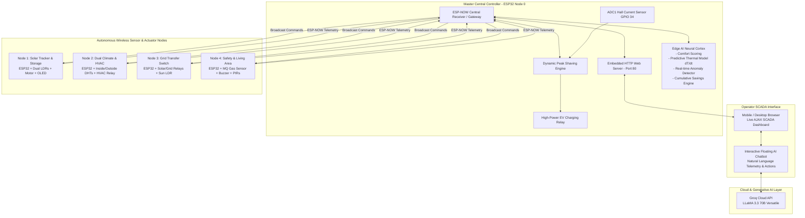

# ⚡ RoboApex: Autonomous Smart Microgrid Gateway & Edge AI Energy Manager

[](https://www.espressif.com/)
[](https://isocpp.org/)
[](https://www.espressif.com/en/solutions/low-power-solutions/esp-now)
[]()
[](https://groq.com/)
[]()
[](LICENSE)

> **RoboApex** is an edge-native, decentralized **Home Energy Management System (HEMS) and Microgrid Gateway**. Built on an array of distributed ESP32 microcontrollers communicating over an internet-independent **ESP-NOW Peer-to-Peer Mesh**, it delivers automated **Dynamic Peak Shaving**, **Edge AI Predictive HVAC Management**, **Solar Transfer Automation**, and a real-time **SCADA Web Dashboard** integrated with an interactive **Groq LLaMA 3.3 70B Conversational AI**.

🎬 **[Watch the Live Demonstration Video](https://lnkd.in/e3QjNY27)**

---

## 🏆 Competition Honors & Recognition
* **National Hackathon:** *RoboDam 2026* for Artificial Intelligence, Robotics, and Energy Sustainability.
* **Organizers:** Damanhour University in collaboration with the **Information Technology Institute (ITI)**.
* **Scale:** Competed against **65 distinguished teams comprising 300+ students from 21 universities across Egypt**.
* **Distinction:** Handpicked by the organizing and judging committees as one of the **TOP 6 standout projects** across the nation to be demonstrated directly before:
  * **H.E. Prof. Dr. Abdelaziz Qonsowa** — Minister of Higher Education and Scientific Research.
  * **Prof. Dr. Elhamy Tarabees** — President of Damanhour University.
  * **Dr. Shady El-Mashad** — Representing the Governor of Beheira.

---

## 📑 Table of Contents
1. [System Architecture & Topology](#-system-architecture--topology)
2. [Core Engineering Innovations](#-core-engineering-innovations)
3. [Distributed Node Architecture](#-distributed-node-architecture)
4. [Hardware Specifications & Pinouts](#-hardware-specifications--pinouts)
5. [Repository Structure](#-repository-structure)
6. [Getting Started & Flashing Guide](#-getting-started--flashing-guide)
7. [The Engineering Team & Mentorship](#-the-engineering-team--mentorship)
8. [License](#-license)

---

## 📐 System Architecture & Topology

The system operates across a decentralized 2.4 GHz RF mesh powered by the **ESP-NOW** protocol, maintaining sub-millisecond response latency and full operational autonomy even in the total absence of Wi-Fi or public internet connectivity.



---

## ⚡ Core Engineering Innovations

### 1. Zero-Latency, Offline-Resilient ESP-NOW Mesh
* **Deterministic Timing:** Eliminates standard 802.11 Wi-Fi connection overhead and handshake latency, achieving packet transmission times under **3ms**.
* **Zero Internet Dependency:** The system maintains full grid-balancing, HVAC control, solar tracking, and emergency gas cutoff autonomously if the internet or local router goes offline.

### 2. Edge AI Neural Cortex (Embedded on ESP32)
* **Predictive Thermal Model ($dT/dt$):** Continuously computes the interior temperature rate-of-change and predicts ambient conditions 30 minutes in advance to optimize HVAC compressor cycles and prevent aggressive inrush surge currents.
* **Thermal Comfort Index:** Approximates real-time human comfort scores based on interior humidity, dry-bulb temperature, and solar heat gain.
* **Energy Anomaly Detection:** Flags uncharacteristic current draws, thermal leakage, and vampire standby loads automatically.
* **Real-time Financial Analytics:** Tracks energy savings in both kilowatt-hours ($kWh$) and local currency ($EGP$) directly in memory.

### 3. Dynamic Grid Peak Shaving & Inverter Protection
* Monitors the primary AC grid feed via high-precision analog sampling.
* When aggregate home current nears breaker or inverter thermal limits ($Threshold = 2800$ raw ADC), the Master node performs **automatic EV load shedding**, dropping the EV charger relay in under **10ms** to prevent brownouts.
* Features a smart hysteresis deadband ($Margin = 150$) to prevent relay chattering.

### 4. Generative AI Conversational SCADA (Groq LLaMA 3.3 70B)
* Directly integrated into the SCADA web interface.
* Users can query system telemetry, investigate anomalies, and trigger hardware actions using natural conversational Arabic or English.
* The chatbot receives live sensor context snapshots and executes device actions via automated HTTP callback hooks (`ACTION: /setEV?state=... | /setClimate?state=...`).

---

## 🛰️ Distributed Node Architecture

| Node | Firmware Directory | Responsibilities | Key Components |
| :--- | :--- | :--- | :--- |
| **Master Gateway** | `firmware/master_gateway/` | Central gateway, SCADA HTTP host, Peak Shaving, Edge AI Cortex, EV Relay | ESP32, Current Sensor, EV Relay |
| **Solar Tracker** | `firmware/node_solar_tracker/` | Dual-axis sun tracking, OLED telemetry, brownout-safe motor sequencing | ESP32, Dual LDRs, DC/Stepper Motor, SSD1306 OLED |
| **Climate & HVAC** | `firmware/node_climate_hvac/` | Dual indoor/outdoor microclimate tracking, intelligent fan/HVAC modulation | ESP32, 2x DHT Sensors, HVAC Control Relay |
| **Grid Transfer** | `firmware/node_grid_transfer/` | Automatic Transfer Switch (ATS) between Solar Inverter and Utility Grid | ESP32, Solar Relay, Grid Relay, Sunlight LDR |
| **Safety & Living** | `firmware/node_safety_living/` | MQ gas leak detection, audible alarms, occupancy sensing, smart lighting | ESP32, MQ Gas Sensor, Active Buzzer, PIR, Lighting Relays |

---

## 🔌 Hardware Specifications & Pinouts

### Master Central Gateway
| Component / Function | ESP32 GPIO | Mode | Description |
| :--- | :--- | :--- | :--- |
| **Current Sensor (CT)** | `GPIO 34` | `INPUT (ADC1)` | Main grid load monitoring |
| **EV Charger Relay** | `GPIO 2` | `OUTPUT` | Automated peak shaving load shedding relay |
| **Wi-Fi SoftAP** | Internal | Access Point | SSID: `HEMS_Master_Gateway` |

### Solar Tracker Node
| Component / Function | ESP32 GPIO | Mode | Description |
| :--- | :--- | :--- | :--- |
| **LDR East** | `GPIO 34` | `INPUT (ADC1)` | Sunlight differential sensing |
| **LDR West** | `GPIO 35` | `INPUT (ADC1)` | Sunlight differential sensing |
| **Motor Drive IN1 / IN2** | `GPIO 18 / 19`| `OUTPUT` | Reversible tracking motor |
| **I2C OLED Display** | `GPIO 21 (SDA) / 22 (SCL)` | `I2C` | 0.96" SSD1306 Monochrome Display |

### Climate & HVAC Node
| Component / Function | ESP32 GPIO | Mode | Description |
| :--- | :--- | :--- | :--- |
| **Outdoor Climate Sensor**| `GPIO 5` | `INPUT` | DHT11/22 Ambient environment sensor |
| **Indoor Climate Sensor** | `GPIO 4` | `INPUT` | DHT11/22 Living area microclimate sensor |
| **HVAC / Fan Relay** | `GPIO 19` | `OUTPUT` | Compressor / Fan cooling actuation |

### Grid Transfer Switch (ATS) Node
| Component / Function | ESP32 GPIO | Mode | Description |
| :--- | :--- | :--- | :--- |
| **Solar Power Relay** | `GPIO 21` | `OUTPUT` | Active-LOW Solar Inverter line switch |
| **Grid Power Relay** | `GPIO 18` | `OUTPUT` | Active-LOW Utility Grid line switch |
| **Solar Irradiance LDR**| `GPIO 34` | `INPUT (ADC1)` | Photovoltaic generation readiness sensor |

### Safety & Living Room Node
| Component / Function | ESP32 GPIO | Mode | Description |
| :--- | :--- | :--- | :--- |
| **MQ Gas Sensor (D0)** | `GPIO 35` | `INPUT` | Toxic & flammable gas threshold alarm |
| **Emergency Buzzer** | `GPIO 25` | `OUTPUT` | High-frequency active buzzer alert |
| **PIR Sensors (Left/Right)**| `GPIO 32 / 33`| `INPUT` | Room occupancy & motion tracking |
| **Curtain Actuator** | `GPIO 12 / 13`| `OUTPUT` | Automated curtain motor drivers |

---

## 📁 Repository Structure

```text
RoboApex-Microgrid-Gateway/
├── firmware/
│   ├── master_gateway/
│   │   └── master_gateway.ino         # Master Gateway, WebServer, Cortex, Groq Chatbot
│   ├── node_solar_tracker/
│   │   └── node_solar_tracker.ino     # Solar tracking motor control & OLED telemetry
│   ├── node_climate_hvac/
│   │   └── node_climate_hvac.ino      # Dual DHT climate analysis & HVAC relay
│   ├── node_grid_transfer/
│   │   └── node_grid_transfer.ino     # Solar/Grid Automatic Transfer Switch (ATS)
│   └── node_safety_living/
│       └── node_safety_living.ino     # MQ Gas emergency detector & living area controls
├── simulations/
│   └── wokwi/                         # Interactive Wokwi simulation circuits & diagrams
│       ├── EV/                        # EV load simulation
│       ├── Lighting/                  # Smart room & lighting simulation
│       └── solar/                     # Solar tracker simulation
├── docs/
│   ├── EV Charging.docx               # Technical documentation on EV integration
│   ├── Load Monitoring & Diagnostics.docx # Power analytics specifications
│   ├── Projects.pdf                   # System presentation overview
│   └── components_list.pdf            # Bill of Materials (BOM) & hardware components
├── .gitignore                         # Build and cache exclusion rules
└── README.md                          # Comprehensive technical documentation
```

---

## 🚀 Getting Started & Flashing Guide

### Prerequisites
1. **Arduino IDE 2.x** or **PlatformIO**.
2. **ESP32 Board Support Package:** Install `esp32 by Espressif Systems` (v2.0.x or v3.0.x compatible).
3. **Required Arduino Libraries:**
   * `Adafruit GFX Library`
   * `Adafruit SSD1306`
   * `DHT sensor library` by Adafruit
   * Standard included: `WiFi.h`, `WebServer.h`, `esp_now.h`

### Flashing Procedure
1. Open the respective `.ino` file in Arduino IDE from the `firmware/` directory.
2. Select your board: **ESP32 Dev Module**.
3. Choose the appropriate COM port.
4. Set Upload Speed: `921600` (or `115200` if connection issues arise).
5. Compile and flash the nodes.
6. Once the Master Gateway is powered on:
   * Connect to the Wi-Fi AP: `HEMS_Master_Gateway` (Password: `123456788`).
   * Navigate to `http://192.168.4.1` to access the live SCADA control dashboard and AI Chatbot!

---

## 👥 The Engineering Team & Mentorship

### Core Engineering Team:
* **Yusuf Abozeid**
* **Osama Mohammed Al Ali**
* **Omar Mohamed**
* **Ziad Sameh**
* **Mariam Samir**
* **Reem Tawfik**

### Academic & Engineering Mentorship:
* **Dr. Ghada Mohamed Afify** — Academic Supervision & Project Guidance.
* **Eng. Mahmoud Magdy** — Technical & Embedded Systems Engineering Mentorship.
* **Eng. Sohaila Abdelazim** — Hardware & Integration Mentorship.

---

## 📜 License
This project is open-source and licensed under the **[MIT License](LICENSE)**.
